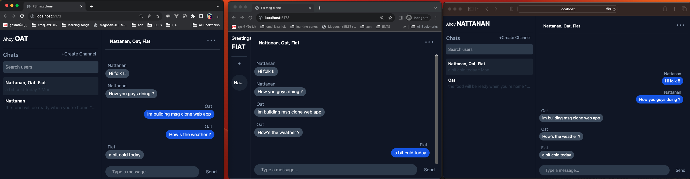
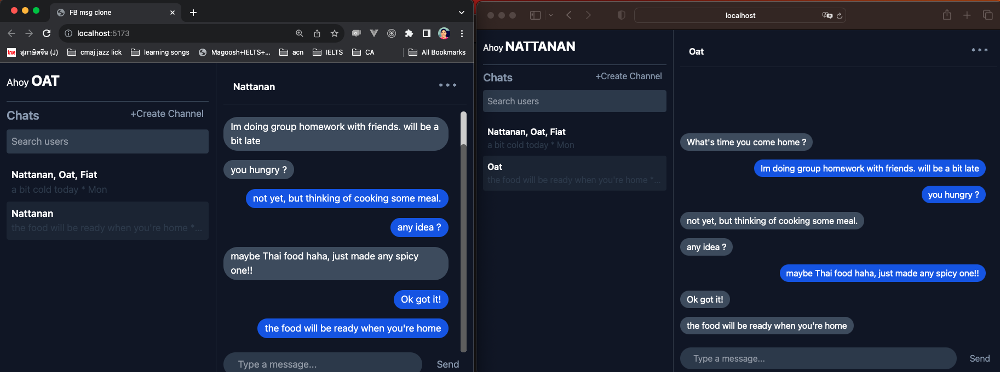
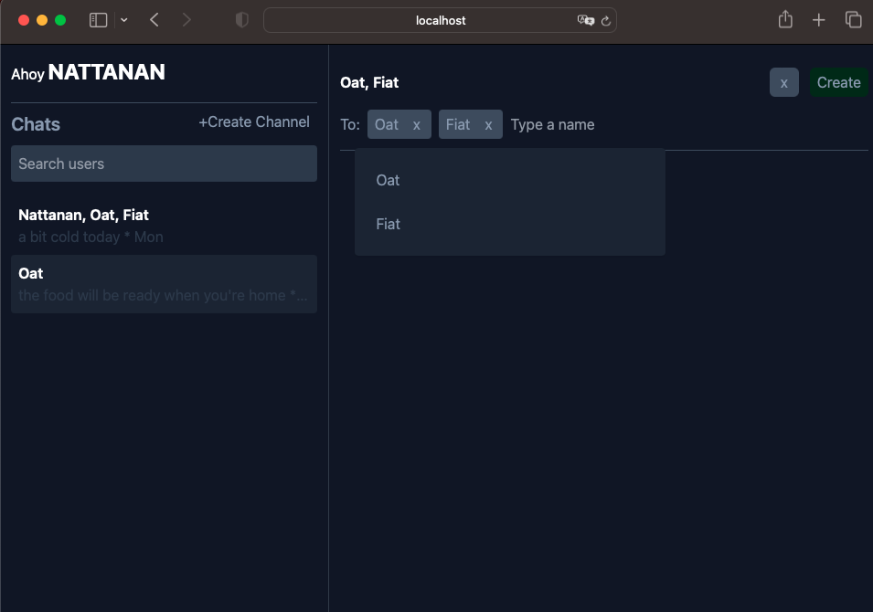
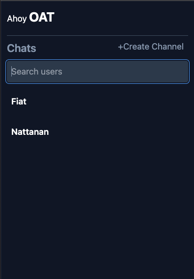

# MsgClone Project

Project intention is to clone facebook messenger application, developed as a -> **Web app (SPA)**

and to be a development skills showcase.

---
### Stacks
> Programming languages
- [![Js][Js-img]][JS-url]
- [![GO][go-img]][go-url]

> Frontend
- [![Svelte][Svelte-img]][Svelte-url]
- [![Vite][vite-img]][vite-url]

> Backend  
- ```Chi``` api routing
- ```gorillar/mux/websocker``` websocket 
- ```postgres``` database
- ```golang-migrate``` database migration
- ```Bash && Makefile``` single developer deployment && tasks automation
- ```mermaid``` diagram designs, help myself remember and to recall
- ```AWS RDS (postgres), EC2 (2 instances), Elastic IPs``` for server, web deployment 
---

### Getting start
Click --> [Facebook msg clone](http://ec2-35-173-149-11.compute-1.amazonaws.com)

---
### Features
1. Everyone that join (by fill your name) this app will --> **automatically be friend with the others**
2. Real time send & receive messages
3. Create private channel
4. Create Group channel
5. Persisted User's channels and theirs messages 
6. Show latest chat's message in channel box

---
### Screen shorts
> group channel 



> private channel



> creating group channel



> creating private channel



---
### Contact
Todsapon Boontap (Oat) 

[Linkedin](https://www.linkedin.com/in/todsapon-boontap-0a949097/)

[Email](aotse.todsapon@outlook.com)

[Upwork profile](https://www.upwork.com/freelancers/~01126d93bb3e706e43) ```upwork acc signon needed```


[Svelte-img]: https://img.shields.io/badge/Svelte-4A4A55?style=for-the-badge&logo=svelte&logoColor=FF3E00
[Svelte-url]: https://svelte.dev/
[JS-img]: https://img.shields.io/badge/Javascript-grey?style=for-the-badge&logo=javascript
[JS-url]: https://en.wikipedia.org/wiki/JavaScript
[go-img]: https://img.shields.io/badge/GO-grey?style=for-the-badge&logo=go
[go-url]: https://en.wikipedia.org/wiki/JavaScript

[vite-img]: https://img.shields.io/badge/vite-grey?style=for-the-badge&logo=vite
[vite-url]: https://en.wikipedia.org/wiki/JavaScript

