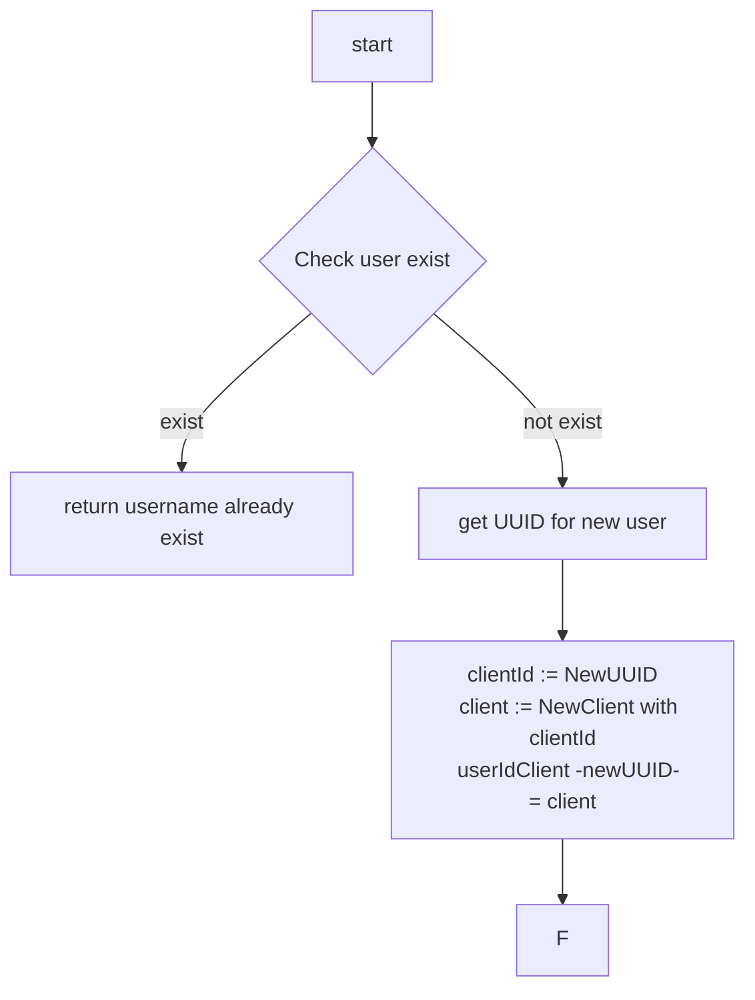
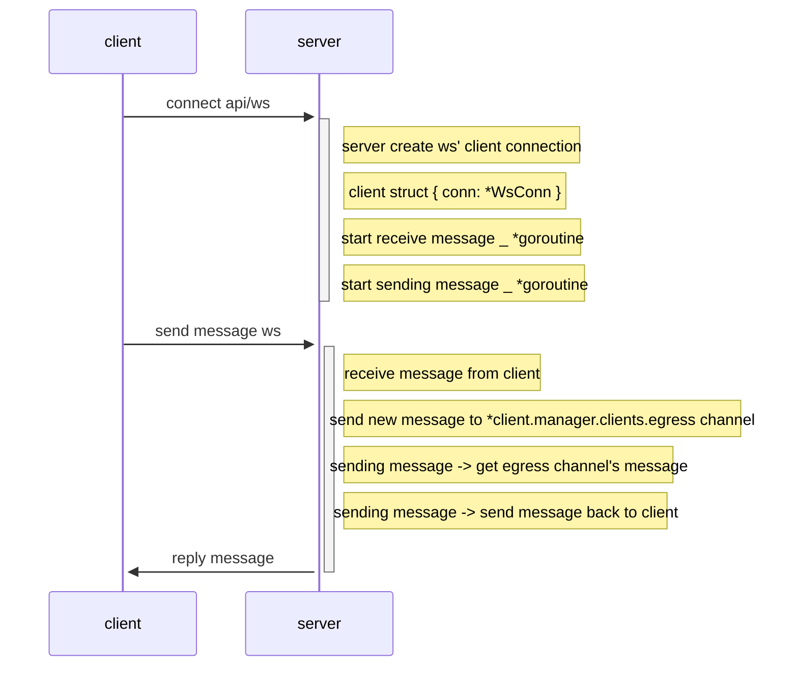
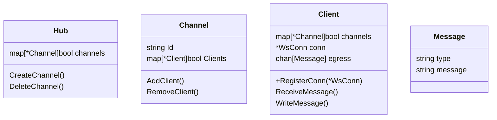
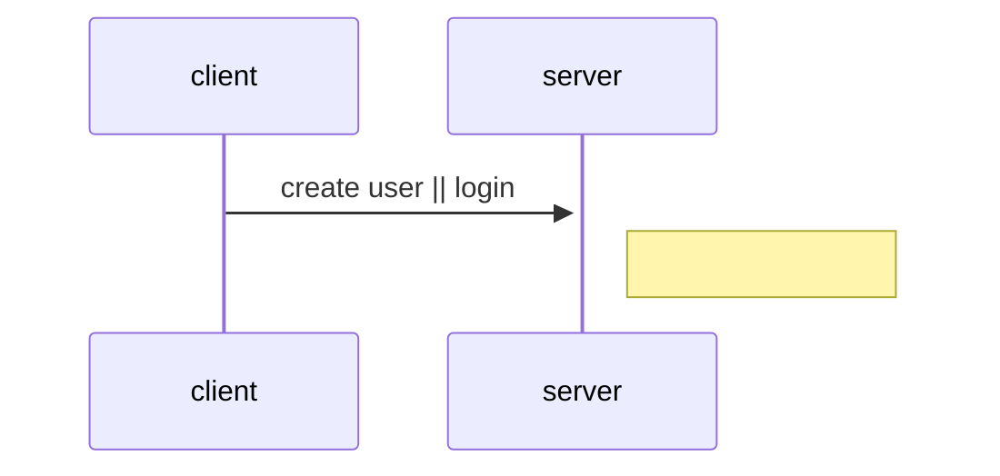

```
POST - api/user
POST - api/create_channel 
       -- body { userIds: []string }

WS - ws/join_channel?channelId="xx"?clientId="dd"
```

---

```go
apiHandlers := []func() { }
createWsHandler := func (*Hub) {
  return func (w http.ResponseWriter, r http.Request) {
   conn, _ := upgrader.Upgrade(w, r, nil)  
	 
  }
}

hub := NewHub()

-- config routes
-- 

start service
```

---


`POST - api/user`


---






